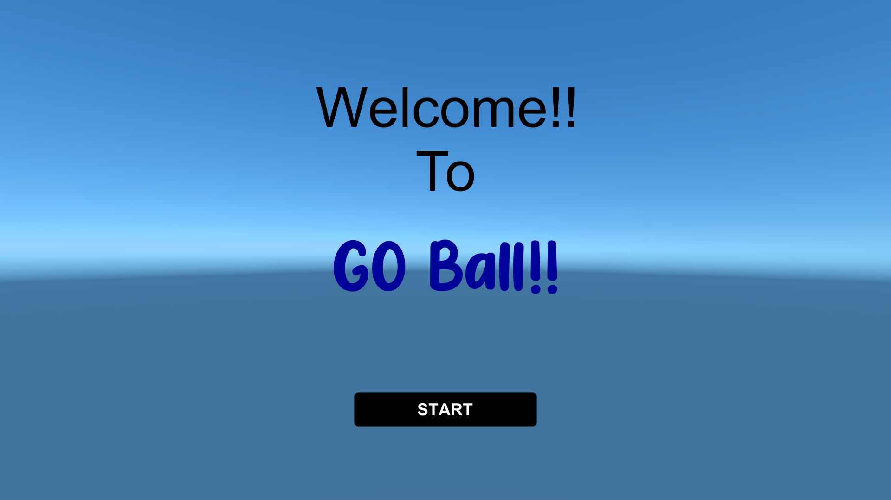
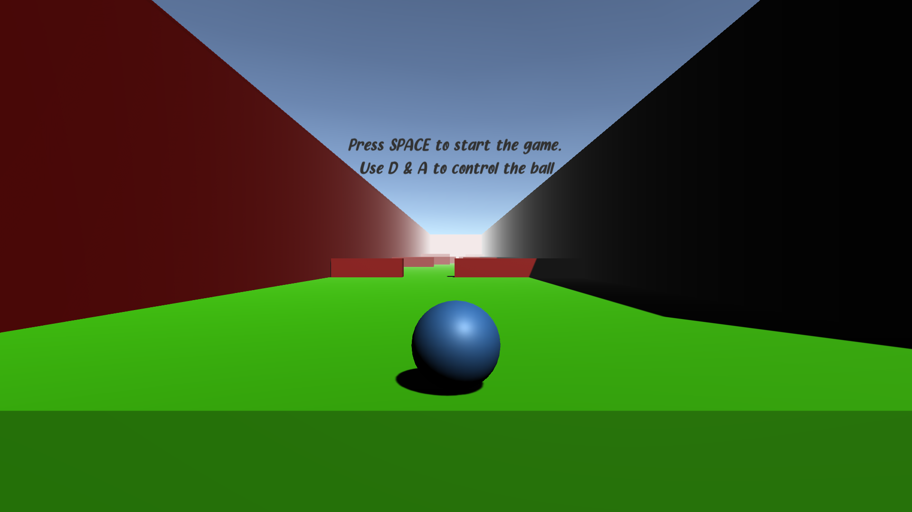
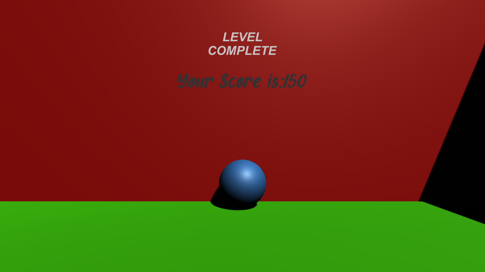
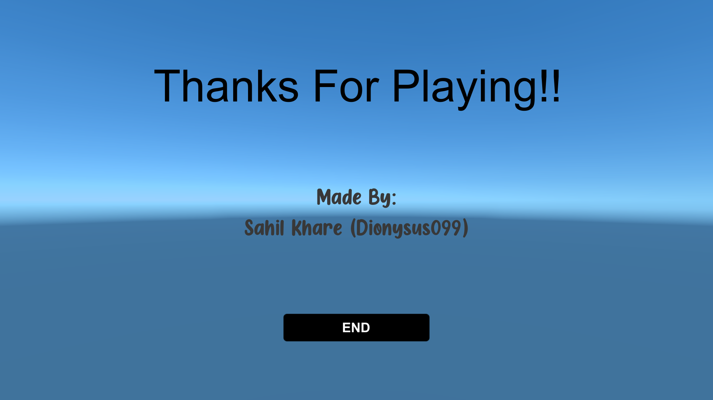

# MyFirstVideoGame
## A Ball Game made using Unity Game Engine in C#.

Here are the Files from Assets and Project Settings from the Game Project.

To Run the Game:

  1. Download Unity Hub.
  2. Dowload these Files to your System.
  3. Open that project in the Unity Editor and preview or Build it from there.

Currently, the Game consists of Three Levels.

### ScreeShots from the Game:

**Start Page:**

**Start Level:**

**Complete Level:**

**End Page:**

### Thanks to Brackeys (https://www.youtube.com/c/Brackeys) for the Tutorials.
